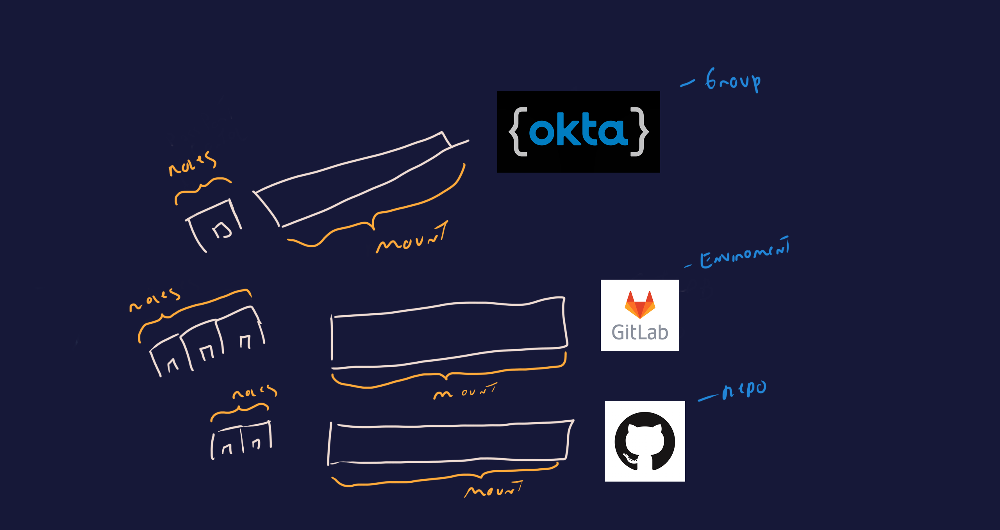

# terraform-vault-jwt-oidc

Hashicorp Vault has the flexibility to use more than one Authentication Method, one of the options


## why JWT/OIDC

from [RFC7519](https://datatracker.ietf.org/doc/html/rfc7519) :

```
JSON Web Token (JWT) is a compact, URL-safe means of representing
   claims to be transferred between two parties.  The claims in a JWT
   are encoded as a JSON object that is used as the payload of a JSON
   Web Signature (JWS) structure or as the plaintext of a JSON Web
   Encryption (JWE) structure, enabling the claims to be digitally
   signed or integrity protected with a Message Authentication Code
   (MAC) and/or encrypted.
```

my take: JWT is a standard way to provide AuthN across different SaaS services like Okta, Gitlab, Github, Azure, AD e etc.




## Problem

The dificulty then comes on how do we configure Vault JWT auth for each of the providers.  more specifically, what configuration is needed from the provider side and what configuration is needed from Vault's side.

to start answering this question we must first look at how Vault's Auth Methods work.

### Vault JWT/OIDC Auth Method

Most Vault Auth Methods are set up in a Multiplex pattern, which allows reuse of a mount for different identities.

the Mount config itself is the link to JWT provider and then the different roles are the Identity checks.

<IMAGE TO WHAT I WANT TO THING ABOUT BRIDGES >

#### Vault JWT/OIDC Mount config
this is where we tell Vault how to reach the Identity Provider. usually this comes in the form of: a connection URL, credentials, who our issuers are and are there any default roles to use if none are provided.

##### Connection URL
this will either be an oidc_discovery_url or jwks_url.

```ruby
oidc_discovery_url="https://token.actions.githubusercontent.com"
```

```ruby
jwks_url = "https://gitlab.com/-/jwks"
```
##### Credentials (Optional)

depending on the Identity Provider, it might be necessary to authenticate , this is done at the mount config level.

```ruby
  oidc_client_id     = okta_app_oauth.vault.client_id
  oidc_client_secret = okta_app_oauth.vault.client_secret
```

##### Bound Issuer (Optional)
 The value against which to match the iss claim in a JWT

 ```ruby
    bound_issuer = "gitlab.com"
```

##### Default Role (Optional)
Any default role you want the used if the Vault Client doesnt specify their own. this requires thought before implemented because it might be a security risk but if you dont define a default role, troubleshooting might be dificult.

 ```ruby
    default_role="demo"
```

#### Vault JWT/OIDC Mount Role

The Roles are where the magic happens. this is how Vault decides if the JWT token it received is valid or not and what it does with it.

##### Allowed Redirect
```ruby
 allowed_redirect_uris = [
    "${var.vault_addr}/ui/vault/auth/${vault_jwt_auth_backend.okta_oidc.path}/oidc/callback",
     # This is for logging in with the CLI if you want.
    "http://localhost:${var.cli_port}/oidc/callback",
  ]
```

##### User Claim
User Claim is what defines a Vault Client (Entity) in some scenarios it might be useful to control this.

 ```ruby
    user_claim="sub"
```
 ```ruby
    user_claim = "environment"
```

##### Bound Audiences or Bound Claims
 ```ruby
    bound_claims = {
        project_id = data.gitlab_project.vault.id
        ref        = "main"
        ref_type   = "branch"
    }

```

 ```ruby
    bound_claims = {
    groups = join(",", each.value.bound_groups)
  }
```

```ruby
 bound_claims = {
         "sub" = "repo:${data.github_repository.vault_actions.full_name}:ref:refs/*"
    }
```

##### Claim Mappings
Claim Mappings are the JWT metadata you want to save on the Vault Entity
```ruby
     claim_mappings = {
        dysplayname=dysplayname,
        surname=surname,
        givenname=givenname,
        preferred_username=preferred_username,
        unique_name=unique_name,
        email=email,
        name=name
        }
```

##### RBAC Policies
Policies are how you provide AuthZ to the auth method, least priviledge should apply and each role should only have access to the secrets they need.

```ruby
    token_policies = ["default", "hcp-root"]
```


